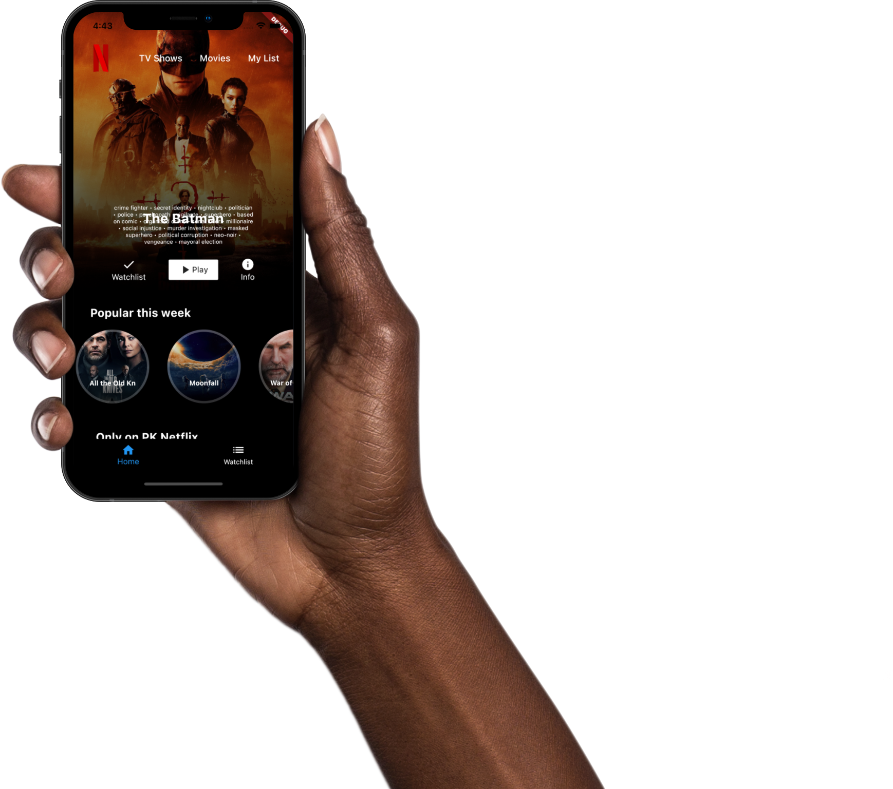

# PK Netflix - Flutter Clone

A basic Netflix clone built with Flutter and powered by Appwrite.io for backend services.

## Features

- **Flutter Frontend**
- **Appwrite.io Backend**

## Screenshots




## Getting Started

1. **Clone the Repository, Install Dependencies, and Run the App**

   ```bash
   git clone https://github.com/your-username/pk-netflix.git
   cd pk-netflix
   flutter pub get
   flutter run
